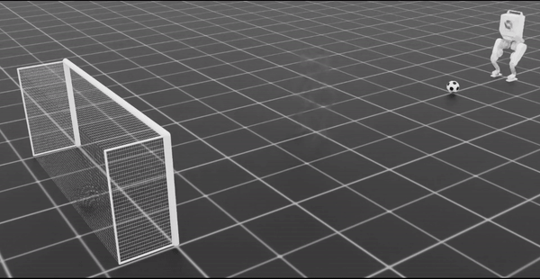
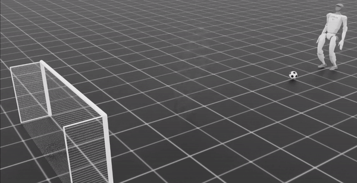
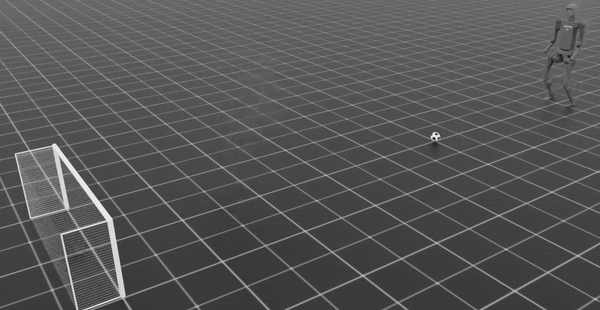
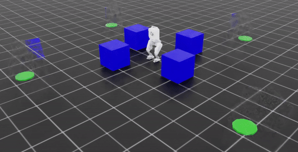
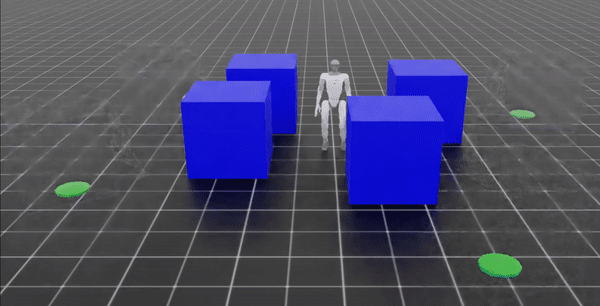

# OGMP ISAAC

[](https://docs.omniverse.nvidia.com/isaacsim/latest/index.html)
[](https://isaac-sim.github.io/IsaacLab/main/index.html)
[](https://docs.python.org/3/whatsnew/3.10.html)
[](https://releases.ubuntu.com/20.04/)

<div>
      
      
      
</div>
<div>
      
      
      
</div>

This repository contains the code for the experiments in the paper - [Dynamic Bipedal Loco-manipulation using Oracle Guided Multi-mode Policies with Mode-transition Preference](https://arxiv.org/abs/2410.01030). Check out the project [website](https://indweller.github.io/ogmplm/) for more details.

Authors: Prashanth Ravichandar, Lokesh Krishna, Nikhil Sobanbabu and Quan Nguyen

# Usage

## Installation
1. Install [Isaac Sim](https://docs.omniverse.nvidia.com/isaacsim/latest/index.html) and [Isaac Lab](https://isaac-sim.github.io/IsaacLab/main/index.html). Activate the conda environment containing the Isaac Lab installation.
2. Clone the repository. Install the project using 
      ```
      python -m pip install -e exts/ogmp_isaac
      ```


## Testing

To play with our best pre-trained policices or a new custom-trained policy, run 

```
python scripts/rsl_rl/play.py --yaml_config ./logs/soccer/release_experiments/H1_DC/exp_conf.yaml --num_envs 1 --visualize --visualize_goalpost
```

This command should run our policy trained for H1 robot playing soccer. All our pretrained policies are available in `./logs/` and ready to play with !

## Training

Each task in the paper has different robot variants, Hence in `exts/ogmp_isaac/config`, for each task we have a 
* **<task_name>_base.yaml**: common hyper-paramters like rewards defintion , reward weights, network architecture, etc 
* **<task_name>_vary.yaml**:  different robots with corresponding kinematic and dynamics paramters. 

in a reader-firendly manner. To then generate a training ready config for a task (say soccer), run 
```
python scripts/experiment/generate.py --base_path ./exts/ogmp_isaac/config/soccer_base.yaml --vary_path ./exts/ogmp_isaac/config/soccer_vary.yaml
```

This permutes the base configuration with the variants and generates a custom training log folder with each variant's config in the `./log` directory with the followying structure.

```
<experiment_name>
      <variant_0>
            exp_conf.yaml
      <variant_1>
            exp_conf.yaml
      .
      .
      .
```

The training can now be deployed in one of two ways,

1. **Deploy all at once**: To automatically train one variant after another in the experiment folder. 
      ```
      python scripts/experiment/deploy.py --exp_logpath ./logs/soccer/release_experiments
      ```
2. **Deploy one**: To train a single variant:
      ```
      python scripts/rsl_rl/train.py --yaml_config ./logs/soccer/release_experiments/H1_DC/exp_conf.yaml --headless
      ```

NOTE: 
* Default is training is done in headless mode with 4096 environments.
* The USD for Berkeley Humanoid is not included in this repository. Please download the USD from [their repository](https://github.com/HybridRobotics/isaac_berkeley_humanoid) repository and place it in the `exts/ogmp_isaac/assets/robots/berkeley_humanoid/biped` directory.

# Citation

If you use this code, please cite the following paper:

```
@misc{ravichandar2024dynamicbipedallocomanipulationusing,
      title={Dynamic Bipedal Loco-manipulation using Oracle Guided Multi-mode Policies with Mode-transition Preference}, 
      author={Prashanth Ravichandar and Lokesh Krishna and Nikhil Sobanbabu and Quan Nguyen},
      year={2024},
      eprint={2410.01030},
      archivePrefix={arXiv},
      primaryClass={cs.RO},
      url={https://arxiv.org/abs/2410.01030}, 
}
```
For the theory on oracle guided policy optimization, refer to the paper [OGMP: Oracle Guided Multi-mode Policies for Agile and Versatile Robot Control](https://arxiv.org/abs/2403.04205).

# License and Disclaimer

The template used in this project is based on [IsaacLabExtensionTemplate](https://github.com/isaac-sim/IsaacLabExtensionTemplate) developed by the Isaac Lab Project Developers, which is licensed under the MIT License.

All other content in this repository is licensed under the MIT License - see the [LICENSE](LICENSE) file for details.